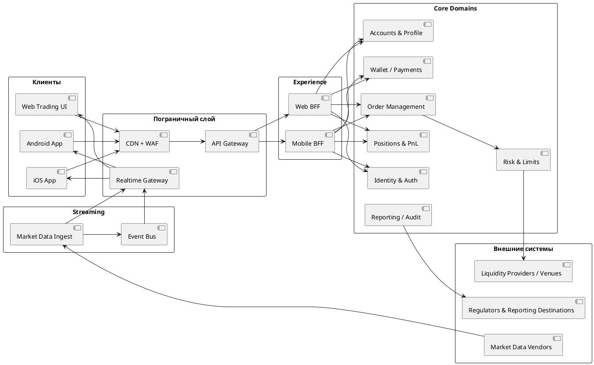
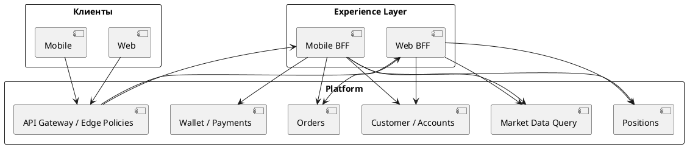
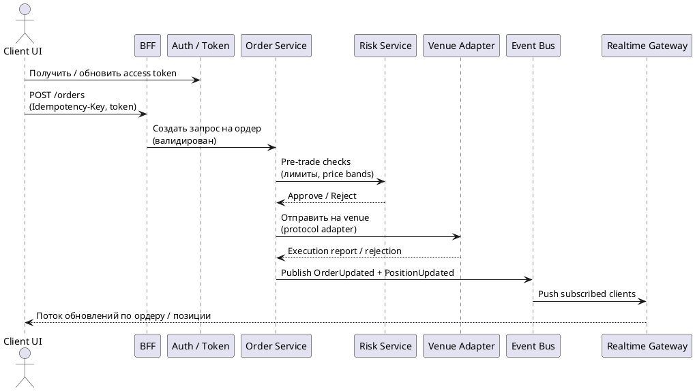
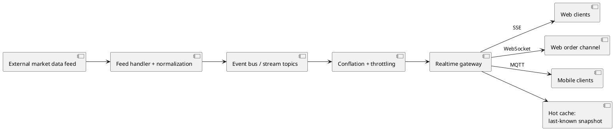

# Архитектурный blueprint современного frontend для розничной трейдинговой платформы
## (с учетом публичных сигналов по FP)

## Краткое резюме

Публичные вакансии и материалы компании FP довольно явно указывают на облачную, cloud-native, микросервисную среду с гетерогенным стеком, event streaming и несколькими типами клиентских приложений (web + native mobile), которым нужны специализированные API и доставка данных в реальном времени.

Подтвержденные сигналы включают Kubernetes/VMware, использование публичных облаков, REST + GraphQL, gRPC, Kafka, Solace и Protobuf, а также современные web- и mobile-фреймворки.

Если проектировать подобную платформу с нуля в 2026 году, наиболее надежный подход для user experience трейдингового уровня будет таким:

1. слой **Backend-for-Frontend (BFF)** для каждого типа клиента (web, iOS, Android), чтобы уменьшить over-fetching / under-fetching и изолировать потребности UI;
2. **двухконтурная API-стратегия**: REST (или RPC) для команд и транзакций + GraphQL (опционально) для агрегирующих чтений, в сочетании с сильной идемпотентностью, версионированием и rate limiting;
3. **streaming-first pipeline** для рыночных данных и обновлений по ордерам, который может отдавать данные через WebSockets / SSE для web и MQTT для mobile, с осознанным использованием backpressure и conflation, чтобы не перегружать UI и сеть.

Для соответствия требованиям compliance и операционной готовности, особенно в ЕС, архитектурные решения должны явно поддерживать auditability, resilience и secure-by-default интеграции. FP публично позиционируется в регуляторных рамках ЕС/Великобритании (CySEC/FCA) и ссылается на MiFID II, а компании в сфере ЕС также должны соответствовать требованиям DORA по операционной устойчивости, действующим с 17 января 2025 года.

---

## Что можно публично понять об архитектуре FP

### Подтвержденные сигналы из публичных страниц FP и вакансий

Публичная страница FP “Life” на LinkedIn перечисляет технологические направления, хорошо соответствующие современной распределенной платформе:

- Kubernetes и VMware;
- cloud-native технологии AWS/Azure;
- клиент-серверное взаимодействие через Solace & Protobuf, REST и GraphQL;
- service-to-service взаимодействие через gRPC и Kafka;
- observability через New Relic, Grafana, Darktrace, Firebase и Kibana;
- CI/CD через GitLab и Jenkins.

В Android-вакансиях FP (рядом с Direct Mobile) явно упоминаются event streaming и локальное хранение данных:

- Kotlin + Coroutines + Jetpack Compose;
- REST;
- MQTT;
- Google Protobuf;
- Room (локальная БД);
- инструменты dependency injection.

Эта комбинация сильно намекает, что **streaming updates + local caching / offline tolerance** являются первоклассным требованием для mobile.

В вакансии senior C++ engineer говорится о разработке “plugins, gateways, APIs for trading platforms”, “proxy services for integration” и “time-critical microservices”, а также перечисляются Solace/Kafka/gRPC/Protobuf как технологии messaging/serialization. Это указывает на integration-heavy и latency-aware сервисы, находящиеся между торговыми платформами и внутренними системами.

В вакансии Senior System Analyst для контекста Front-End / Direct Mobile прямо ожидается практический анализ REST, GraphQL и WebSockets, что усиливает вывод: frontend работает сразу с несколькими парадигмами взаимодействия — request/response и realtime.

### Регуляторный контекст, влияющий на архитектурные ограничения

На странице “Licences & Regulation” FP указано, что:

- FP Financial Services Ltd регулируется Cyprus Securities and Exchange Commission (лицензия 078/07);
- FP UK Limited регулируется Financial Conduct Authority (регистрационный номер 509956).

Также там есть ссылка на MiFID II и трансграничное лицензирование.

На продуктовой стороне собственная страница платформы FP продвигает web-трейдинг с виджетами и “<12ms execution time” — это маркетинговое заявление, не проверенное независимо, — а также мобильное приложение для account/fund management “наряду с мощной торговой платформой”.

### Явные пробелы в публичной информации

FP не публикует подробно и авторитетно:

- внутреннюю топологию маршрутизации ордеров;
- стек поставщиков рыночных данных;
- наличие или отсутствие matching engine компонентов;
- детали pre-trade risk;
- точные realtime-транспорты на web (SSE, WebSockets или что-то иное).

Поэтому любые дальнейшие рассуждения о внутренних деталях FP — это **обоснованные выводы**, основанные на типовых архитектурах брокеров/бирж и перечисленных технологических сигналах.

---

# Целевая архитектурная схема современной брокерской трейдинговой платформы

## Архитектурный замысел и разбиение

Практичный способ спроектировать такую платформу с нуля, особенно под несколькими регуляторами и несколькими типами клиентов — разделить систему на три плоскости:

### 1. Experience plane

Web app + mobile apps + BFF.

Это слой, отвечающий за:

- агрегацию данных под UI;
- адаптацию протоколов;
- tailoring payload под клиента.

Это соответствует паттерну Backend-for-Frontends: backend-сервисы должны быть развязаны с frontend-реализациями, а payload адаптирован под каждый тип клиента.

### 2. Trading and customer domain plane

Сюда входят:

- identity / profile / KYC;
- funds / wallet / payments;
- orders / positions;
- risk / limits;
- reporting / audit.

Для low-latency трейдинговых сценариев обработка ордеров должна оставаться детерминированной, а синхронный fan-out должен быть ограничен.

### 3. Streaming plane

Сюда входят:

- ingestion и normalization рыночных данных;
- event bus;
- fanout gateways;
- client subscriptions.

Streaming-платформы здесь нужны для always-on real-time capture, durable storage и real-time processing, что соответствует позиционированию Kafka и типовым event-driven архитектурам.

---

## Диаграммы для интервью

### 1. C4-style context diagram

Эта структура соответствует:

- необходимости client-specific shaping backend-а через BFF;
- брокерской архитектуре, в которой рыночные данные и ордера — это принципиально разные типы нагрузки: streaming против transactional.

#### PlantUML

### 2. BFF architecture diagram

Эта диаграмма соответствует логике BFF из Azure/Microsoft guidance и более широким API-gateway / microservices паттернам:

- не связывать клиентские приложения напрямую с внутренней топологией сервисов;
- не превращать единый gateway в монолитный “mega gateway”.

#### PlantUML

### 3. Sequence diagram for “place order” with realtime updates

Pre-trade controls давно считаются стандартным ожиданием в регулируемом electronic market access, и отдельный системный слой pre-trade control активно обсуждается в регуляторной литературе, даже если точные обязательства зависят от класса активов и venue model.

#### PlantUML

---

## Рекомендуемые ключевые компоненты и обоснование

Актуальный blueprint 2026 года для платформы, похожей на FP и типичного брокера, включает:

### AuthN / AuthZ

OAuth 2.0 + OpenID Connect:

- short-lived access tokens;
- refresh tokens;
- поддержка MFA.

OIDC здесь выступает identity-layer поверх OAuth 2.0.

### API Gateway

Отвечает за:

- TLS termination;
- интеграцию с WAF;
- request shaping;
- auth enforcement;
- единый rate limiting для публичных API.

При этом BFF-логику лучше не размещать в shared gateway, чтобы не превратить его в “gateway monolith”.

### BFF

Нужен для:

- UI-specific aggregation;
- composition view-model;
- protocol adaptation.

Вниз: REST / GraphQL.  
Вверх: WebSocket / SSE / MQTT.

### Event bus + streaming

Нужен для внутреннего pub/sub, распределения market data и событий по ордерам.

Kafka — канонический пример distributed event streaming platform с:

- durable storage;
- scalable publish/subscribe;
- stream processing.

### Serialization strategy

- JSON — для публичного REST, где важна дебажимость;
- Protobuf — для высокочастотных внутренних стримов и клиентских стримов, где важны компактность payload и скорость декодирования.

### External connectivity

Protocol adapters для venues / LPs.

FIX — широко используемый стандарт в trading.  
FAST — используется для эффективной передачи market data большого объема.

---

## Frontend-архитектурные паттерны для trading web и mobile

### State model, determinism и UI integrity

Высокочастотные обновления market data и ордеров могут быстро ввести UI в неконсистентное состояние, если клиент не использует стабильную state model и ясные правила слияния обновлений, например:

- last-write-wins по sequence;
- server-authoritative snapshots + incremental deltas.

Guidance по Jetpack Compose подчеркивает, что **unidirectional data flow** особенно хорошо подходит для таких сценариев:

- события идут вверх;
- состояние идет вниз;
- улучшаются тестируемость и консистентность.

На практике trading UI выигрывает от разделения состояния на два явных трека:

#### Authoritative state (идет от сервера)

- balances;
- orders;
- positions.

#### Ephemeral UI state

- selections;
- chart settings;
- expanded panels;
- “pending order” banners;
- loading states.

Такое разделение уменьшает случайную связанность между отображением UI и фактической транзакционной истиной, что критично при latency и retry.

### Offline handling и degraded-network behavior

Даже если торговые действия требуют онлайн-связи, современное приложение все равно должно быть “полезным offline” хотя бы для неторговых сценариев:

- portfolio history;
- watchlists;
- cached instruments;
- last-known prices с явной индикацией устаревания.

#### Web

Service Workers выступают прокси между браузером и сетью, enabling:

- offline experience;
- caching strategies.

#### Android

Room — стандартный local persistence layer поверх SQLite, который позволяет кешировать важные данные и давать пользователю возможность просматривать часть информации offline.

### Latency budgets, perceived performance и trading UX

В trading screens latency ощущается особенно остро: пользователь постоянно наблюдает:

- цены;
- статус ордера;
- изменение маржи.

Поэтому проектирование идет одновременно по двум осям:

#### Objective latency

Сколько реально занимает обновление.

#### Perceived latency

Насколько быстро UI реагирует визуально.

RAIL model хорошо ложится на trading-flows:

- пользователь нажал Buy;
- сразу увидел Pending;
- затем Filled / Rejected.

Для web Core Web Vitals формализуют ключевые UX-метрики и дают ориентиры по performance.  
Кроме того, web.dev прямо рекомендует CDN как один из рычагов улучшения TTFB на initial load.

Для loading behavior хорошо подходят **skeleton states**, описанные и в Material Design, и у Nielsen Norman Group.

Для mutations возможен **optimistic UI**, особенно в GraphQL-экосистемах, когда UI обновляется до ответа сервера, а потом reconciles. Это подходит для:

- watchlist edits;
- UI preferences.

Но не подходит для risk-sensitive trading outcomes без четкого подтвержденного статуса.

---

## API и интеграционный дизайн для trading-нагрузок

### REST vs GraphQL в trading UI

FP явно ожидает опыт с REST + GraphQL + WebSockets, поэтому на интервью важно уметь объяснить, где что использовать.

### Практическое разделение

#### REST (или RPC) — для команд

Например:

- place order;
- cancel order;
- deposit / withdraw;
- change leverage settings.

Это операции, где важны:

- четкая HTTP semantics;
- idempotency controls;
- простая observability.

#### GraphQL — для read aggregation

Например:

- dashboard composition;
- aggregated portfolio tiles;
- instrument details с вложенными sub-resources;
- client-driven field selection.

GraphQL сам по себе специфицирован формально, но GraphQL over HTTP все еще является working draft, поэтому опираться на него как на “жесткий и окончательный контракт” без оговорок рискованно.

### Сравнение REST и GraphQL для trading UI

#### REST

- лучше для transactional commands и простых reads;
- хорошо сочетается с HTTP caching semantics;
- имеет понятные versioning patterns;
- observability естественно строится по endpoint-level metrics;
- проще в ошибках и retry logic.

#### GraphQL

- лучше для UI-driven aggregation и избежания over/under-fetching;
- schema evolution идет через deprecation, но требует governance;
- с shared caching сложнее;
- нужна field-level tracing/logging;
- partial errors и resolver failures требуют дополнительных соглашений.

### Idempotency, retries и защита от двойного создания ордеров

Trading-команды должны безопасно переживать:

- retries;
- mobile reconnects;
- client-side timeouts.

HTTP определяет, какие методы идемпотентны по своей семантике:

- PUT / DELETE — идемпотентны;
- POST — нет.

Для неидемпотентных операций, которым все равно нужна retry safety, используется Idempotency-Key для POST/PATCH.

Практический сильный вариант для проектирования с нуля:

- идемпотентность обеспечивается на API boundary;
- используется idempotency key;
- сервер делает dedupe;
- один и тот же ответ может быть replay для того же ключа;
- внутри системы все равно нужно проектировать effectively-once / exactly-once semantics для order entry и wallet operations.

### Versioning и contract safety

Для frontend-команд biggest integration risk — breaking changes.

Поэтому:

- versioning API должен быть продуман заранее;
- gateways / BFF должны снижать coupling клиентов к внутренним refactoring backend-а;
- event schemas в streaming-контрактах надо управлять так же строго, как REST / GraphQL;
- Protobuf помогает enforce shared contract.

---

## Realtime delivery и trade-offs

### WebSocket vs SSE vs Polling

В trading UI вопрос обычно не в том, нужен ли realtime — нужен.  
Вопрос в том, **какая форма realtime подходит каждому типу потока**.

#### WebSocket

- full-duplex;
- bidirectional;
- хорош для order entry channels, interactive subscriptions, control signals;
- сложнее в эксплуатации.

#### SSE

- server → client push по HTTP;
- хорошо подходит для market price ticks, notifications, server-driven status updates;
- проще operationally.

#### Polling

- самый простой;
- но дорогой по QPS и latency;
- обычно допустим только как fallback для низкокритичных данных.

### Практичный гибридный дизайн 2026

#### Web

- SSE для market data fanout;
- WebSockets для interactive channels и подписок, где клиент тоже должен что-то отправлять;
- fallback предусмотрен явно.

#### Mobile

- MQTT хорошо подходит для lightweight pub/sub и reconnect/session behavior;
- это соответствует и Android stack signal у FP.

### Operational connection management

На масштабе WebSockets — это уже stateful plumbing.

Нужно явно учитывать:

- поддержку protocol upgrades на proxy;
- timeout / keepalive;
- long-lived connection behavior;
- поведение load balancer.

### Real-time market data flow diagram

Здесь специально вставлена стадия conflation / throttling, потому что market data может приходить быстрее, чем UI способен ее отрисовать. Использование backpressure — стандартная практика для streaming systems.

#### PlantUML

---

## Performance, caching и resilience

### Стратегия кэширования по классам данных

Trading platform сочетает и cache-friendly, и cache-hostile данные.  
Корректность зависит от правильного ответа на три вопроса:

- что кэшировать;
- где кэшировать;
- как инвалидировать.

#### 1. Static assets

JS / CSS / fonts / images:

- CDN;
- long TTL;
- versioned filenames.

#### 2. Public reference data

Например:

- instrument lists;
- trading hours.

Подход:

- aggressive caching;
- ETag / Last-Modified;
- разумный TTL.

#### 3. Personalized account data

Например:

- balances;
- margin;
- open orders.

Подход:

- по умолчанию `private`;
- часто `no-store`;
- избегать shared-cache storage, если нет строгого обоснования.

#### 4. Realtime price ticks

Их нельзя отдавать через generic HTTP caching.

Подход:

- streaming;
- hot snapshot cache на realtime gateway;
- fast initial paint;
- reconnect support.

### Роль CDN в trading UI

CDN — это распределенный набор серверов, который кэширует контент ближе к пользователю, ускоряя загрузку web assets.

Для dynamic workloads CDN не всегда может полноценно кешировать данные, но:

- edge connectivity;
- persistent connections;
- offload origin

все равно могут снизить latency.

Безопасный принцип для trading:

**CDN ускоряет shell, а streaming и authenticated APIs отдают истину.**

---

## Event-driven resilience patterns

Для брокерского уровня корректности внутри системы обычно нужна комбинация:

- at-least-once delivery;
- deduplication;
- transactional publication patterns.

### Transactional Outbox

Событие публикуется надежно без distributed transactions:

- запись в outbox идет в той же DB transaction;
- затем relay в broker.

### Kafka

Подходит как:

- scalable;
- fault-tolerant;
- event streaming platform.

И прямо заявляет exactly-once processing guarantees.

### Reactive Streams

Формализует non-blocking backpressure, что особенно важно для:

- market data fanout;
- ограничения нагрузки на UI rendering.

---

## Security, compliance и подготовка к интервью

### Security controls, критичные для trading frontend и API

Для API-heavy fintech-систем OWASP API Security Top 10 дает очень прикладные категории риска:

- broken object level authorization;
- broken authentication;
- и т.д.

Это напрямую ложится на ресурсы вида:

- `/accounts/{id}`;
- `/orders/{id}`;
- `/positions/{id}`.

Для mobile OWASP MASVS — хороший industry-standard по:

- secure storage;
- anti-tampering;
- secure networking.

### Базовая security architecture, которая хорошо звучит на интервью

- OAuth 2.0 + OIDC;
- short-lived tokens;
- secure refresh patterns;
- fine-grained authorization на уровне ресурса;
- `no-store/private` по умолчанию для чувствительных endpoint-ов;
- structured audit logging для торговых действий и привилегированных операций.

### Regulatory / operational resilience для ЕС

#### DORA

Регламент ЕС 2022/2554 вводит требования digital operational resilience и применяется с 17 января 2025.

#### MiFID II

Требует от firm принимать “all sufficient steps” для best execution, с учетом:

- price;
- cost;
- speed;
- likelihood;
- и др.

Архитектурное следствие:

- надо корректно фиксировать routing decisions;
- timestamps;
- order lifecycle events.

Хорошая позиция системного аналитика на интервью:

**такие frontend-фичи, как order history, fills и confirmations — это тоже compliance surface**, потому что они должны опираться не на UI state, а на immutable, auditable event sources и консистентные timestamps.

---

## Практические interview scenarios

Ниже сценарии, которые наиболее напрямую бьются с ожиданиями FP.

### Сценарий 1. Design the API + realtime updates for Orders and Positions

Ожидаемый фокус:

- command idempotency;
- clear state machine;
- realtime updates через WebSocket / SSE / MQTT;
- reconnection;
- snapshot-on-connect.

### Сценарий 2. Market data fanout at scale without melting clients

Ожидаемый фокус:

- event bus;
- conflation;
- backpressure;
- client-side render throttling;
- отказ от per-tick REST polling.

### Сценарий 3. BFF vs direct client-to-microservice

Ожидаемый фокус:

- почему BFF уменьшает coupling;
- почему он предотвращает bloated mega-gateway;
- как он помогает с payload shaping, pagination defaults, UI-specific orchestration.

### Сценарий 4. Caching plan for a trading web app

Ожидаемый фокус:

- семантика RFC 9111;
- `Cache-Control: no-store/private`;
- CDN только для static assets;
- безопасный ETag-based revalidation для reference data.

---

## Checklist тем для Senior System Analyst (Direct Mobile / Front-End)

Нужно уверенно знать:

- rationale, boundaries и failure modes паттерна BFF;
- coexistence patterns для REST + GraphQL;
- статус GraphQL over HTTP draft и его практические implications;
- trade-offs WebSockets / SSE / MQTT;
- operational requirements для proxies / load balancers;
- idempotency, retries и safe command processing;
- state management для mobile + web под streaming updates;
- offline strategy: Service Workers / Room;
- performance engineering: RAIL, Core Web Vitals, skeletons, optimistic UI;
- security: OWASP API Top 10, OWASP MASVS, object-level authorization, token handling;
- DORA applicability;
- MiFID II best execution implications для data capture и reporting.

---

## Нормализованный список источников по смыслу

### Primary FP signals

- FP “Licences & Regulation”
- FP trading platform page
- FP LinkedIn “Life” tech stack summary
- FP job postings for System Analyst / Android / C++

### Core architecture and standards

- Azure / Microsoft guidance on BFF and API Gateway
- RFC 6455 WebSocket
- WHATWG HTML SSE
- GraphQL specification
- GraphQL over HTTP working draft
- Kafka official docs
- MQTT standard (OASIS)
- Protobuf docs
- OpenID Connect Core
- OAuth 2.0
- HTTP RFC 9110 / RFC 9111
- Idempotency-Key draft
- Stripe idempotency guidance

### Security and regulation

- OWASP API Security Top 10 (2023)
- OWASP MASVS
- DORA Regulation (EU) 2022/2554
- ESMA / MiFID II best execution materials
